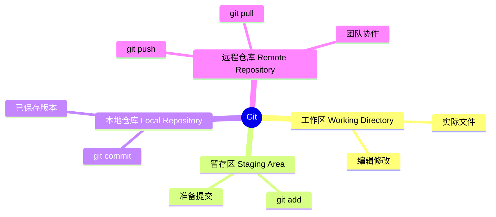
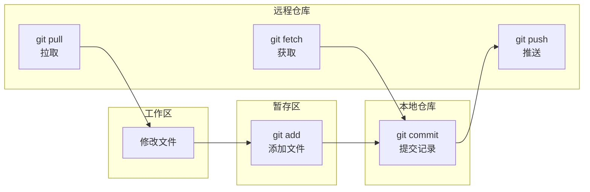
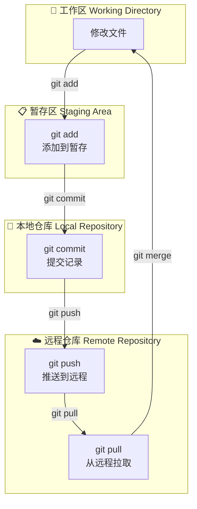
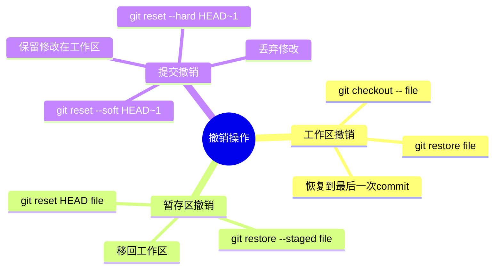
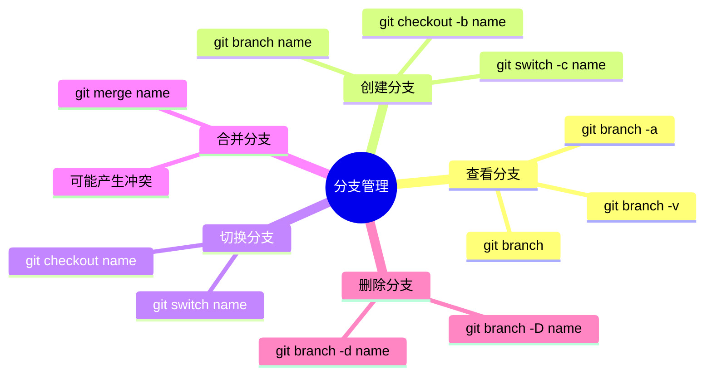
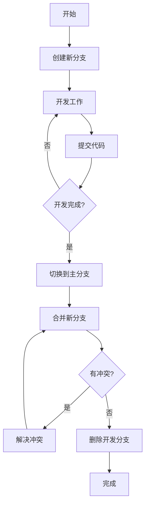
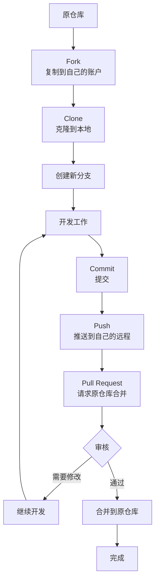
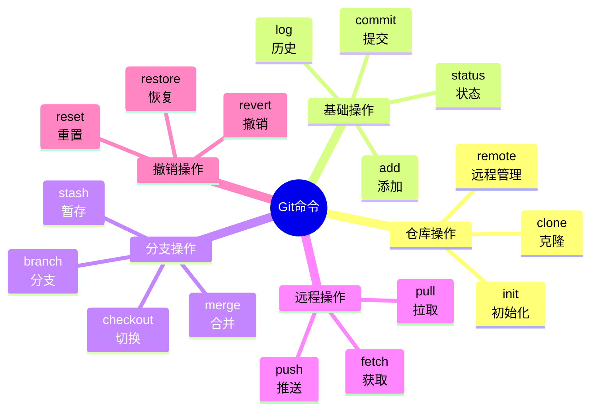

# Git基础：版本控制的入门指南

## 什么是Git

Git是一个分布式版本控制系统，用于追踪文件变化、协作开发、备份代码。

### Git核心概念思维导图



### Git工作流程图



**为什么程序员必须学习Git：**
- 代码备份和恢复
- 多人协作开发
- 追踪代码变更
- 管理不同版本

## 安装Git

### Windows安装
```
1. 访问 https://git-scm.com/download/win
2. 下载安装包并运行
3. 安装选项保持默认即可
4. 安装完成后，右键菜单会多出"Git Bash Here"
```


| 图标 | 官网下载 |
|------|----------|
|  | https://git-scm.com/download/win |

### 验证安装
```cmd
git --version
# 显示 git version 2.x.x 即安装成功
```

## 基础配置

### 设置用户信息
```bash
# 全局配置（所有项目都用这个身份）
git config --global user.name "你的名字"
git config --global user.email "your.email@example.com"

# 单个项目配置（当前项目目录内执行，不加 --global）
git config user.name "项目特定的名字"
git config user.email "project@example.com"
```

### 常用配置
```bash
# 设置默认分支名为 main（新版Git默认）
git config --global init.defaultBranch main

# 设置拉取代码时使用 rebase 策略（保持提交历史整洁）
git config --global pull.rebase false

# 设置别名（可选）
git config --global alias.st status
git config --global alias.co checkout
git config --global alias.lg "log --oneline --graph --all"
```

### 查看配置
```bash
git config --list          # 查看所有配置
git config user.name       # 查看用户名
```

## 创建仓库

### 初始化新仓库
```bash
# 进入项目目录
cd /path/to/your/project

# 初始化Git仓库
git init

# 查看当前状态
git status
```

### 克隆已有仓库
```bash
# 克隆远程仓库
git clone https://github.com/user/repo.git

# 克隆到指定目录
git clone https://github.com/user/repo.git my-folder

# 克隆特定分支
git clone -b develop https://github.com/user/repo.git
```

## 基础操作

### 工作流程图



### 添加和提交
```bash
# 查看当前状态
git status

# 添加单个文件到暂存区
git add filename.txt

# 添加所有文件
git add .

# 添加所有修改和删除，但不包含未跟踪文件
git add -u

# 提交到本地仓库
git commit -m "提交说明：这次做了什么修改"

# 添加并提交（快捷方式）
git commit -am "提交说明"
# 注意：-am 只对已跟踪的文件有效，新文件仍需先 git add
```

### 查看历史
```bash
# 查看提交历史
git log

# 简洁的单行显示
git log --oneline

# 图形化显示分支
git log --graph --oneline --all

# 查看最近N次提交
git log -n 5

# 查看特定文件的提交历史
git log -- filename.txt
```

### 撤销操作思维导图



> [!WARNING]
> `git reset --hard` 会永久丢失未提交的修改，操作前请确保重要更改已提交或备份。

**安全操作（推荐）：**

```bash
# 撤销工作区的修改（恢复到最近一次commit）
git checkout -- filename.txt
# 或（新语法）
git restore filename.txt

# 取消暂存（从暂存区移回工作区）
git reset HEAD filename.txt
# 或（新语法）
git restore --staged filename.txt
```

**高级操作（有风险）：**

```bash
# 撤销最后一次提交（保留修改在工作区）
git reset --soft HEAD~1

# 撤销最后一次提交（不保留修改）— 有数据丢失风险
git reset --hard HEAD~1

# 危险：撤销所有未提交的修改（慎用！）— 有数据丢失风险
git reset --hard HEAD
```

## 分支管理

### 分支管理思维导图



### 分支管理流程图



### 查看分支
```bash
# 查看本地分支
git branch

# 查看所有分支（包括远程）
git branch -a

# 查看分支详情
git branch -v
```

### 创建和切换分支
```bash
# 创建新分支
git branch feature-xxx

# 切换到指定分支
git checkout feature-xxx
# 或（新语法）
git switch feature-xxx

# 创建并切换（一步完成）
git checkout -b feature-xxx
# 或（新语法）
git switch -c feature-xxx
```

### 合并分支
```bash
# 1. 切换到要合并到的分支（通常是main）
git checkout main
# 或
git switch main

# 2. 合并指定分支
git merge feature-xxx

# 如果有冲突，需要手动解决冲突后 git add 和 git commit
```

### 删除分支

> [!CAUTION]
> 强制删除分支（-D）会永久丢失未合并的提交，请确保分支内容已合并或不再需要。

**安全删除（推荐）：**
```bash
# 删除已合并的分支
git branch -d feature-xxx
```

**强制删除（有风险）：**
```bash
# 强制删除分支（即使未合并）— 可能丢失未合并的提交
git branch -D feature-xxx

# 删除远程分支
git push origin --delete feature-xxx
```

### 常见的分支命名
| 分支类型 | 命名示例 | 说明 |
|----------|----------|------|
| 主分支 | main / master | 稳定版本 |
| 开发分支 | develop / dev | 开发中版本 |
| 功能分支 | feature/xxx | 新功能 |
| 修复分支 | hotfix/xxx | 紧急修复 |
| 发布分支 | release/xxx | 发布准备 |

## 远程仓库

### GitHub


| 图标 | 资源 |
|------|------|
|  | https://github.com/ |

### 添加远程仓库
```bash
# 查看远程仓库
git remote -v

# 添加远程仓库
git remote add origin https://github.com/user/repo.git

# 重命名远程仓库
git remote rename origin upstream
```

### 推送和拉取
```bash
# 推送代码到远程
git push origin main
# 简写（首次设置上游分支）
git push -u origin main
# 简写（之后）
git push

# 拉取代码
git pull

# 拉取远程分支
git pull origin feature-xxx

# 如果远程和本地有冲突，先拉取、解决冲突、再推送
```

### 同步远程仓库
```bash
# 获取远程更新（不合并）
git fetch origin

# 获取并合并
git pull

# 从远程拉取到新分支
git checkout -b feature-xxx origin/feature-xxx
```

## 实用技巧

### 暂存工作
```bash
# 暂存当前工作（临时保存修改）
git stash

# 查看暂存列表
git stash list

# 恢复暂存（并保留暂存）
git stash apply

# 恢复并删除暂存
git stash pop

# 删除暂存
git stash drop
```

### 比较差异
```bash
# 查看工作区vs暂存区
git diff

# 查看暂存区vs仓库
git diff --cached

# 查看两个分支的差异
git diff main..feature-xxx

# 查看特定文件的差异
git diff -- filename.txt
```

### 标签管理
```bash
# 创建标签
git tag v1.0.0

# 查看标签
git tag

# 删除标签
git tag -d v1.0.0

# 推送标签到远程
git push origin v1.0.0

# 推送所有标签
git push origin --tags
```

### 查看文件内容
```bash
# 查看文件在某个版本的内容
git show HEAD~1:filename.txt

# 查看某个版本的所有文件
git ls-tree HEAD~1
```

## 常见问题

### 1. 合并冲突
```bash
# 冲突标记
<<<<<<< HEAD
当前分支的内容
=======
其他分支的内容
>>>>>>> feature-xxx

# 解决方法：手动编辑文件，删除标记，保留正确内容
# 然后 git add 和 git commit
```

### 2. 忽略文件
创建 `.gitignore` 文件：
```
# 忽略所有 .log 文件
*.log

# 忽略 node_modules 目录
node_modules/

# 忽略特定文件
secret.txt

# 忽略编译输出
build/
dist/
```

### 3. SSL证书问题
```bash
# 跳过SSL验证（不推荐用于重要项目）
git config --global http.sslVerify false

# 使用SSH代替HTTPS
git remote set-url origin git@github.com:user/repo.git
```

### 4. 用户名密码保存
```bash
# Windows凭证存储
git config --global credential.helper manager

# 或使用SSH密钥登录（更安全）
```

## GitHub 协作基础

### Fork 和 Pull Request 流程



### Fork 和 Pull Request
```
1. Fork：在GitHub上复制别人的仓库到你的账户
2. Clone：把Fork的仓库克隆到本地
3. 创建分支：在你的仓库创建功能分支
4. 提交：正常 git add 和 git commit
5. Push：推送到你的远程仓库
6. Pull Request：在GitHub上发起PR，请求原仓库合并你的代码
```

## Git 命令速查图



## 常用命令速查表

| 命令 | 作用 |
|------|------|
| `git init` | 初始化仓库 |
| `git clone <url>` | 克隆仓库 |
| `git add .` | 添加到暂存区 |
| `git commit -m "msg"` | 提交 |
| `git push` | 推送到远程 |
| `git pull` | 拉取远程更新 |
| `git status` | 查看状态 |
| `git log` | 查看提交历史 |
| `git branch` | 查看分支 |
| `git checkout <branch>` | 切换分支 |
| `git merge <branch>` | 合并分支 |
| `git stash` | 暂存工作 |
| `git diff` | 查看差异 |

## 学习资源

| 资源 | 图标 | 链接 |
|------|------|------|
| Git官网 |  | https://git-scm.com/ |
| GitHub |  | https://github.com/ |
| GitHub Skills |  | https://skills.github.com/ |
| Git教程（廖雪峰） | | https://www.liaoxuefeng.com/wiki/0013739516305929606dd18361248578c67b8067c8c017b000 |
| Pro Git中文版 |  | https://git-scm.com/book/zh/v2 |

> **建议**：Git 是程序员必备技能，建议在命令行中多练习，熟练后可以学习使用 GitHub Desktop 或 VS Code 的图形化工具。
