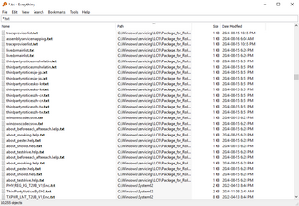

# 文件搜索：快速找到需要的文件

## Windows自带搜索

### 任务栏搜索
- 点击任务栏搜索框
- 输入文件名、内容关键词
- 支持快速启动应用程序

### 资源管理器搜索
```
1. 打开任意文件夹
2. 在右上角搜索框输入关键词
3. 支持按名称、修改日期、类型筛选
```

**搜索运算符：**
| 运算符 | 示例 | 作用 |
|--------|------|------|
| `AND` | `type:docx AND author:张三` | 同时满足条件 |
| `OR` | `type:jpg OR type:png` | 满足任一条件 |
| `NOT` | `type:doc NOT name:草稿` | 排除条件 |
| `*` | `name:*2024*` | 通配符匹配 |
| `date:` | `date:today` | 按日期筛选 |
| `size:` | `size:large` | 按大小筛选 |
| `type:` | `type:folder` | 按类型筛选 |

**高级搜索示例：**
```
size:giant name:report        # 大文件且名称包含report
datemodified:01/01/2024..12/31/2024  # 2024年内修改
type:video author:张三分机  # 某人编辑的视频
```

## Everything（推荐）

一款超快速的本地文件搜索工具，秒级搜索数百万文件。



### 核心优势
| 特性 | 说明 |
|------|------|
| **极速搜索** | 基于文件名索引，毫秒级响应 |
| **轻量级** | 资源占用极低 |
| **免费无广告** | 开源免费 |
| **正则支持** | 支持高级搜索语法 |

### 官网下载
| 图标 | 链接 |
|------|------|
|  | https://www.voidtools.com/zh-cn/ |

### 常用技巧

**1. 即时搜索**
```
输入文件名部分字符
- 不需要完整的文件名
- 输入越精确，结果越少
```

**2. 路径搜索**
```
# 搜索特定路径下的文件
path:C:\Windows\System32 cmd.exe

# 搜索特定扩展名
ext:.docx

# 组合搜索
path:C:\Users docx size:>1MB
```

**3. 正则表达式**
```
# 使用正则更精确搜索
regex:^report.*2024.*\.xlsx$
```

**4. 筛选器**
```
# 按大小筛选
size:>100MB
size:1GB..10GB

# 按日期筛选
dm:today       # 今天修改
dc:thisweek   # 本周创建

# 按类型筛选
filetype:folder
```

**5. 收藏夹和过滤**
```
- 右键结果可添加到收藏夹
- 创建常用搜索的过滤视图
```

## 高级搜索命令

### Windows 索引搜索
在搜索框使用：
```
kind:documents           # 所有文档
kind:pictures            # 所有图片
kind:music               # 所有音乐
kind:videos              # 所有视频
kind:programs            # 所有程序
```

### 命令行搜索

**使用 where 命令：**
```cmd
# 搜索可执行文件
where notepad.exe

# 搜索多个位置
where /r C:\Windows *.dll
```

**使用 PowerShell：**
```powershell
# 搜索文件名
Get-ChildItem -Path C:\ -Filter "*.txt" -Recurse -ErrorAction SilentlyContinue

# 搜索文件内容
Select-String -Path "C:\*.txt" -Pattern "关键词"

# 快速搜索（利用索引）
Get-ChildItem -Path C:\ -Include "*.docx" -Recurse |
    Where-Object {$_.LastWriteTime -gt (Get-Date).AddDays(-7)}
```

### Windows Search 索引管理
```
1. 设置 > 搜索 > Windows > 高级搜索索引
2. 可添加/排除特定文件夹
3. 重建索引解决搜索不准确问题
```

## 内容搜索

### grep 搜索（Git Bash / WSL）
```bash
# 在当前目录搜索包含关键词的文件
grep -r "关键词" .

# 搜索特定类型文件
grep -r "关键词" --include="*.py"

# 显示行号
grep -rn "关键词" .

# 忽略大小写
grep -ri "关键词" .
```

### Windows 原生内容搜索
```powershell
# 搜索文件内容
Select-String -Path "C:\*.txt" -Pattern "要找的文本"

# 递归搜索
Get-ChildItem -Path "C:\" -Recurse -Include "*.txt" |
    Select-String -Pattern "要找的文本"
```

### Agent Ransack

| 图标 | 特点 | 下载 |
|------|------|------|
|  | 支持文件内容搜索、正则、压缩包搜索 | https://www.mythicsoft.com/agentransack/ |

### Listary（国产）

| 图标 | 特点 | 下载 |
|------|------|------|
|  | 双重Ctrl调出、文件内容搜索、快速切换目录 | https://www.listary.com/ |

## 搜索最佳实践

### 1. 善用文件命名规范
```
推荐命名：
  项目名_日期_版本_描述
  2024-03-15_会议纪要_销售部.docx
  Report_2024Q1_Final.pdf

避免：
  新建文件(1).docx
  未命名-副本-Final-v2-最终版.docx
```

### 2. 利用收藏夹和标签
- Everything 支持收藏常用路径
- 保持搜索结果的收藏习惯

### 3. 定期整理文件
```
建议结构：
  C:\Projects\项目名\
    ├── docs\          # 文档
    ├── src\           # 源码
    ├── assets\        # 资源
    └── output\        # 输出
```

### 4. 善用搜索筛选
```
搜索时添加限制条件：
  时间范围：今天/本周/本月
  文件大小：排除无用的大文件
  文件类型：精确指定扩展名
```

## 常见问题

| 问题 | 解决方法 |
|------|----------|
| 搜索太慢 | 安装 Everything 建立索引 |
| 搜索不到文件 | 检查是否在索引范围内 |
| 内容搜索无结果 | 确认搜索路径和关键词 |
| 索引不更新 | 重建 Windows 搜索索引 |

## 软件推荐汇总

| 软件 | 图标 | 特点 | 适用场景 |
|------|------|------|----------|
| **Everything** |  | 极速文件名搜索 | 日常文件定位 |
| **Listary** |  | 国产，双击调出 | 快速访问 |
| **Agent Ransack** |  | 内容搜索 | 文档内容查找 |
| **PowerGREP** | | 高级内容搜索 | 大量文件搜索 |
| **DocFetcher** | | 文档内容索引 | PDF/Word搜索 |

## 参考资料

| 资源 | 图标 | 链接 |
|------|------|------|
| Everything官网 |  | https://www.voidtools.com/zh-cn/ |
| Agent Ransack |  | https://www.mythicsoft.com/agentransack/ |
| Listary |  | https://www.listary.com/ |

> **提示**：建立良好的文件命名习惯 + 使用 Everything 类工具，能让文件搜索效率提升10倍以上。
