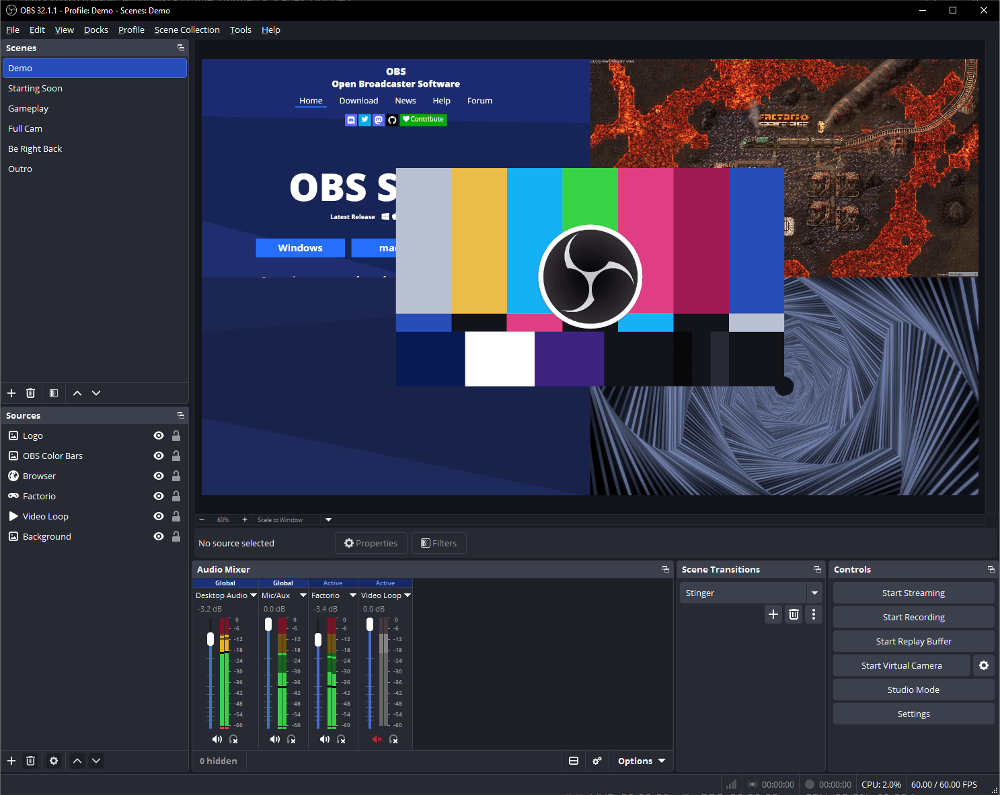
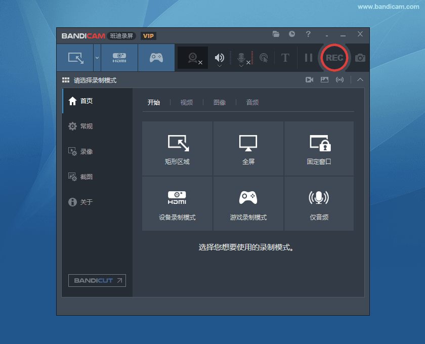
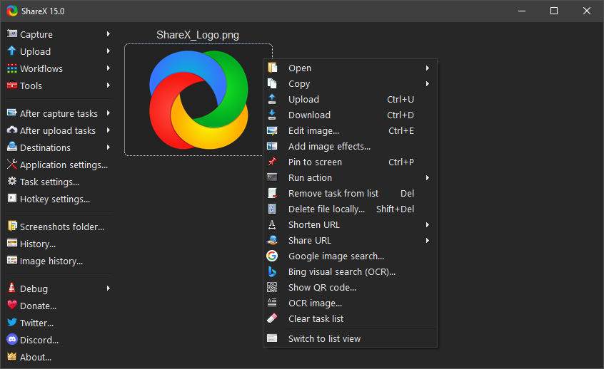

# 录屏与截图工具：记录屏幕内容

## 截图工具

详见：[截图的N种方式](screenshot_ways.md)

## 为什么要录屏

录屏在以下场景非常有用：
- 软件教程制作
- 在线课程录制
- 游戏精彩瞬间记录
- Bug 问题反馈
- 远程协助演示

## 常见录屏工具

### Windows 内置

#### Xbox Game Bar
- **适用系统**：Windows 10/11
- **快捷键**：`Win + G`
- **优点**：系统内置，无需安装
- **缺点**：功能简单，不能录桌面

#### 剪映

- **优点**：免费、简单易用
- **缺点**：导出有水印（付费可去除）
- **下载地址**：https://capcut.cn/

### 专业录屏软件

#### OBS Studio

- **类型**：免费开源
- **优点**：功能强大、免费无水印、可直播
- **缺点**：有一定学习成本
- **平台**：Windows/Mac/Linux
- **下载地址**：https://obsproject.com/

#### Bandicam

- **类型**：商业软件
- **优点**：录制文件小，质量高，游戏录制强
- **缺点**：免费版有水印和功能限制
- **下载地址**：https://www.bandicam.cn/

#### Camtasia
- **类型**：商业软件
- **优点**：自带编辑器、适合制作教程
- **缺点**：价格较高
- **下载地址**：https://www.camtasias.com/

#### ShareX

- **类型**：免费开源
- **优点**：轻量、功能丰富
- **缺点**：仅 Windows
- **下载地址**：https://getsharex.com/

## 各工具对比

| 工具 | 价格 | 水印 | 游戏录制 | 编辑功能 | 平台 |
|------|------|------|----------|----------|------|
| Xbox Game Bar | 免费 | 无 | 支持 | 无 | Windows |
| 剪映 | 免费/付费 | 免费版有 | 支持 | 有 | Windows/Mac |
| OBS Studio | 免费开源 | 无 | 支持 | 无（需配合编辑） | 全平台 |
| Bandicam | 付费 | 免费版有 | 强 | 无 | Windows |
| Camtasia | 付费 | 无 | 支持 | 强大 | Windows/Mac |
| ShareX | 免费开源 | 无 | 支持 | 基础 | Windows |

## OBS Studio 使用指南

### 为什么推荐 OBS

- 完全免费，无水印
- 录制质量高
- 支持多场景切换
- 可直播推流
- 社区活跃，教程丰富

### 基础设置

#### 添加录制源

1. 点击"来源"面板下的"+"按钮
2. 选择录制类型：
   - **窗口捕获**：录制特定窗口
   - **屏幕捕获**：录制整个屏幕
   - **显示器捕获**：录制整个显示器

#### 录制设置

```
文件 > 设置 > 输出
- 输出模式：高级
- 录制格式：mkv（无损）或 mp4
- 编码器：根据显卡选择（NVIDIA NVENC 推荐）
```

### 推荐设置

```json
{
  "输出": {
    "输出模式": "高级",
    "编码器": "NVIDIA NVENC（推荐）/ AMD VCE / 软件编码",
    "位率": "5000-15000 kbps（根据需求调整）",
    "帧率": "30（日常）或 60（游戏）"
  },
  "视频": {
    "基础分辨率": "1920x1080",
    "输出分辨率": "1920x1080（或根据需求缩放）",
    "FPS": "30或60"
  }
}
```

### 录制快捷键

| 快捷键 | 功能 |
|--------|------|
| `Win + Alt + R` | 开始/停止录制 |
| `Win + Alt + P` | 暂停录制 |
| `Win + Alt + M` | 静音/取消静音 |

## 录屏技巧

### 1. 减少文件大小

- 降低分辨率（录制 1080p 但导出 720p）
- 降低帧率（日常教程 15-30fps 足够）
- 调整码率（不是越高越好）
- 使用硬件编码（减少 CPU 占用）

### 2. 提高录制质量

- 游戏录制建议 60fps
- 文档教程 30fps 足够
- 适当提高码率
- 选择合适的编码器

### 3. 声音设置

- 系统声音：录制电脑音频
- 麦克风：录制讲解
- 桌面音频：录制背景音乐
- 建议分别控制音量

## 游戏录制

### Xbox Game Bar

1. 按 `Win + G` 打开
2. 点击"捕获"按钮
3. 使用 `Win + Alt + R` 开始录制

**限制**：
- 不能录桌面
- 游戏支持不稳定
- 不适合长时间录制

### OBS 游戏捕获

1. 创建"游戏捕获"源
2. 选择要录制的游戏窗口
3. 确保游戏以全屏模式运行

**优点**：
- 稳定可靠
- 性能开销小
- 可添加摄像头overlay

## 录制后处理

### 剪辑工具

| 工具 | 特点 | 适用场景 |
|------|------|----------|
| 剪映 | 简单易用、模板多 | 快速剪辑 |
| Premiere | 专业强大 | 专业制作 |
| DaVinci Resolve | 免费专业 | 专业剪辑 |
| OBS 配合编辑 | 无水印 | 简单剪辑 |

### 格式转换

录制格式推荐：
- **MKV**：无损、易编辑
- **MP4**：兼容性好、文件小

可用 FFmpeg 转换：
```bash
ffmpeg -i input.mkv -c copy output.mp4
```

## 常见问题

### Q1：录屏画面卡顿
**解决方法**：
1. 降低录制分辨率或帧率
2. 使用硬件编码
3. 关闭不必要的后台程序
4. 检查硬盘空间是否充足

### Q2：没有声音
**解决方法**：
1. 检查系统声音是否开启
2. 检查 OBS 音频设置
3. 确保"桌面音频"和"麦克风"已启用
4. 某些游戏需要额外设置

### Q3：游戏无法捕获
**解决方法**：
1. 以管理员身份运行 OBS
2. 尝试使用"窗口捕获"而非"游戏捕获"
3. 关闭游戏的反作弊软件
4. 检查游戏是否支持全屏模式

### Q4：文件太大
**解决方法**：
1. 降低码率设置
2. 使用 MP4 格式（H.264）
3. 使用硬件编码
4. 录制后进行压缩

## 选择建议

| 使用场景 | 推荐工具 |
|----------|----------|
| 偶尔录屏 | Xbox Game Bar、剪映 |
| 游戏录制 | Bandicam、OBS |
| 制作教程 | OBS + 剪映/Camtasia |
| 直播推流 | OBS |
| 无水印免费 | OBS、ShareX |

> **提示**：不同的录屏工具适合不同的场景。如果是偶尔使用，系统内置的 Xbox Game Bar 或剪映足够；如果需要高质量，专业级的录制，OBS Studio 是最好的免费选择。
